# Mock Variable Dependencies

## Data Flow Through BA_PACKAGE

```mermaid
flowchart TD
    subgraph CMDEF_VARS["CMDEF_VARS.cmake (constants)"]
        ARCH["CMDEF_ARCHITECTURE\n= 'mock_arch'"]
        DISTRO["CMDEF_DISTRO_ID\n= 'mock_distro'"]
        VER["CMDEF_DISTRO_VERSION_ID\n= '0.0.0'"]
    end

    subgraph CMUTIL["CMUTIL.cmake"]
        CMUTIL_CFG["config: MOCK_CMUTIL_PLATFORM_STRING\n(optional override)"]
        CMUTIL_CAP["captured: MOCK_CMUTIL_PLATFORM_STRING_CONSTRUCT_CALLED"]
    end

    subgraph BA["BA_PACKAGE (production code)"]
        PLAT["platform_string"]
        PKG["package_string\n= {prefix}{name}{suffix}_{version}_{platform}.zip"]
        GIT["git_path\n= {DISTRO_ID}/{VERSION_ID}/{ARCH}"]
        KW["keywords\n= BACPACK;{NAME};{BUILD_TYPE}"]
        RF["remote_file"]
    end

    subgraph STORAGE["CMLIB_STORAGE.cmake"]
        ST_CFG["config: MOCK_CMLIB_STORAGE_TEMPLATE_INSTANCE_OUTPUT\n(optional override, default: mock URL)"]
        ST_CALLED["captured: MOCK_CMLIB_STORAGE_TEMPLATE_INSTANCE_CALLED"]
        ST_TVAR["captured: MOCK_CMLIB_STORAGE_TEMPLATE_INSTANCE_TEMPLATE_VAR"]
        ST_TVAL["captured: MOCK_CMLIB_STORAGE_TEMPLATE_INSTANCE_TEMPLATE_VALUE"]
        ST_AN["captured: MOCK_CMLIB_STORAGE_TEMPLATE_INSTANCE_ARCHIVE_NAME"]
        ST_GP["captured: MOCK_CMLIB_STORAGE_TEMPLATE_INSTANCE_GIT_PATH"]
        ST_REV["captured: MOCK_CMLIB_STORAGE_TEMPLATE_INSTANCE_REVISION"]
        ST_PGN["captured: MOCK_CMLIB_STORAGE_TEMPLATE_INSTANCE_PACKAGE_GROUP_NAME"]
    end

    subgraph DEP["CMLIB_DEPENDENCY.cmake"]
        DEP_CALLED["captured: MOCK_CMLIB_DEPENDENCY_CALLED"]
        DEP_URI["captured: MOCK_CMLIB_DEPENDENCY_URI"]
        DEP_KW["captured: MOCK_CMLIB_DEPENDENCY_KEYWORDS"]
        DEP_TYPE["captured: MOCK_CMLIB_DEPENDENCY_TYPE"]
        DEP_ATYPE["captured: MOCK_CMLIB_DEPENDENCY_ARCHIVE_TYPE"]
        DEP_GREV["captured: MOCK_CMLIB_DEPENDENCY_GIT_REVISION"]
        DEP_GPATH["captured: MOCK_CMLIB_DEPENDENCY_GIT_PATH"]
    end

    subgraph CACHE["CMLIB_CACHE.cmake (CACHE_ONLY path)"]
        CA_CFG["config: MOCK_CMLIB_CACHE_GET_RETURN_PATH\n(empty = cache miss)"]
        CA_CALLED["captured: MOCK_CMLIB_CACHE_GET_CALLED"]
        CA_KW["captured: MOCK_CMLIB_CACHE_GET_KEYWORDS"]
    end

    ARCH --> PLAT
    DISTRO --> PLAT
    VER --> PLAT
    CMUTIL_CFG -.->|overrides| PLAT

    ARCH --> GIT
    DISTRO --> GIT
    VER --> GIT

    PLAT --> PKG

    PKG --> ST_AN
    GIT --> ST_GP
    ST_CFG -->|returned as| RF
    RF --> DEP_URI

    KW --> DEP_KW
    KW --> CA_KW
```



## Variable Categories

### Configuration (set by test before calling production code)

| Variable | Mock | Default | Effect |
|---|---|---|---|
| `MOCK_CMUTIL_PLATFORM_STRING` | CMUTIL | constructed from args | Overrides platform_string |
| `MOCK_CMLIB_STORAGE_TEMPLATE_INSTANCE_OUTPUT` | CMLIB_STORAGE | `https://mock.example.com/mock_expanded_uri` | Returned as `remote_file` → captured in `MOCK_CMLIB_DEPENDENCY_URI` |
| `MOCK_CMLIB_CACHE_GET_RETURN_PATH` | CMLIB_CACHE | empty string, simulates cache miss | Returned as `cache_path` |
| `TEST_CMCONF_<var_name>` | CMCONF | no default, must be defined by test | Returned by `CMCONF_GET(var_name)` |

### Captured (set by mock during production code execution)

| Variable | Captured From | Source in BA_PACKAGE |
|---|---|---|
| `MOCK_CMUTIL_PLATFORM_STRING_CONSTRUCT_CALLED` | function call | `CMUTIL_PLATFORM_STRING_CONSTRUCT(...)` |
| `MOCK_CMLIB_STORAGE_TEMPLATE_INSTANCE_CALLED` | function call | `CMLIB_STORAGE_TEMPLATE_INSTANCE(...)` |
| `MOCK_CMLIB_STORAGE_TEMPLATE_INSTANCE_TEMPLATE_VAR` | 2nd positional arg | `template_var` (name of variable holding URI template) |
| `MOCK_CMLIB_STORAGE_TEMPLATE_INSTANCE_TEMPLATE_VALUE` | dereferenced 2nd arg | `${template_var}` (the actual template string) |
| `MOCK_CMLIB_STORAGE_TEMPLATE_INSTANCE_ARCHIVE_NAME` | `ARCHIVE_NAME` kwarg | `package_string` = `{prefix}{name}{suffix}_{version}_{platform}.zip` |
| `MOCK_CMLIB_STORAGE_TEMPLATE_INSTANCE_GIT_PATH` | `GIT_PATH` kwarg | `{DISTRO_ID}/{VERSION_ID}/{ARCH}` |
| `MOCK_CMLIB_STORAGE_TEMPLATE_INSTANCE_REVISION` | `REVISION` kwarg | `BA_PACKAGE_VARS__REVISION` |
| `MOCK_CMLIB_STORAGE_TEMPLATE_INSTANCE_PACKAGE_GROUP_NAME` | `PACKAGE_GROUP_NAME` kwarg | `package_name` (original, not expanded) |
| `MOCK_CMLIB_DEPENDENCY_CALLED` | function call | `CMLIB_DEPENDENCY(...)` |
| `MOCK_CMLIB_DEPENDENCY_URI` | `URI` kwarg | `remote_file` (= return value of `CMLIB_STORAGE_TEMPLATE_INSTANCE`) |
| `MOCK_CMLIB_DEPENDENCY_KEYWORDS` | `KEYWORDS` kwarg | `BACPACK;{NAME_UPPER}[;{BUILD_TYPE}]` |
| `MOCK_CMLIB_DEPENDENCY_TYPE` | `TYPE` kwarg | `ARCHIVE` |
| `MOCK_CMLIB_DEPENDENCY_ARCHIVE_TYPE` | `ARCHIVE_TYPE` kwarg | `ZIP` |
| `MOCK_CMLIB_DEPENDENCY_GIT_REVISION` | `GIT_REVISION` kwarg | `revision` (only if `GIT_PATH_TEMPLATE` is set) |
| `MOCK_CMLIB_DEPENDENCY_GIT_PATH` | `GIT_PATH` kwarg | 2nd `CMLIB_STORAGE_TEMPLATE_INSTANCE` result (only if `GIT_PATH_TEMPLATE` is set) |
| `MOCK_CMLIB_CACHE_GET_CALLED` | function call | `CMLIB_CACHE_GET(...)` (only if `CACHE_ONLY`) |
| `MOCK_CMLIB_CACHE_GET_KEYWORDS` | `KEYWORDS` kwarg | same keywords as `CMLIB_DEPENDENCY` |

### Constants (CMDEF_VARS.cmake)

| Variable | Value |
|---|---|
| `CMDEF_ARCHITECTURE` | `mock_arch` |
| `CMDEF_DISTRO_ID` | `mock_distro` |
| `CMDEF_DISTRO_VERSION_ID` | `0.0.0` |

## Key Mock-to-Mock Dependency

```
MOCK_CMLIB_STORAGE_TEMPLATE_INSTANCE_OUTPUT ──→ MOCK_CMLIB_DEPENDENCY_URI
```

The mock does **not** perform template expansion. It returns `OUTPUT` (or a default URL) as `remote_file`,
which BA_PACKAGE then passes as `URI` to `CMLIB_DEPENDENCY`. Therefore `MOCK_CMLIB_DEPENDENCY_URI`
always equals `MOCK_CMLIB_STORAGE_TEMPLATE_INSTANCE_OUTPUT` (or the default) — it does **not** reflect
the computed `package_string`.

To verify the actual archive name computed by BA_PACKAGE, check `MOCK_CMLIB_STORAGE_TEMPLATE_INSTANCE_ARCHIVE_NAME`.

## Execution Paths

| Condition | Path | Mocks Involved |
|---|---|---|
| `CACHE_ONLY=OFF` (default) | CMUTIL → CMLIB_STORAGE → CMLIB_DEPENDENCY | CMDEF_VARS, CMUTIL, CMLIB_STORAGE, CMLIB_DEPENDENCY |
| `CACHE_ONLY=ON` | CMUTIL → CMLIB_STORAGE → CMLIB_CACHE | CMDEF_VARS, CMUTIL, CMLIB_STORAGE, CMLIB_CACHE |
| `BA_PACKAGE_PREREQ_CMCONF_INIT` | CMCONF only | CMCONF |

## Include Order (include_general.cmake)

1. CMDEF_VARS
2. CMUTIL
3. CMLIB_STORAGE
4. CMLIB_DEPENDENCY

CMLIB_CACHE is **not** included by default — tests requiring `CACHE_ONLY` include it separately.

CMCONF is **not** included by default — `BA_PACKAGE_PREREQ_CMCONF_INIT` tests include it separately.

