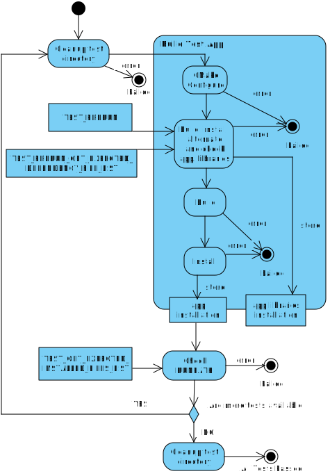

# BA_PACKAGE_DEPS Tests

- [BA_PACKAGE_DEPS Tests](#ba_package_deps-tests)
  - [Run Tests](#run-tests)
  - [Test application architecture](#test-application-architecture)
    - [Application Libraries (dependencies)](#application-libraries-dependencies)
    - [Application Libraries - use case altering](#application-libraries---use-case-altering)
    - [Use Case / Test files](#use-case--test-files)
  - [Test Run Workflow](#test-run-workflow)

Test that dependency install management works as expected.

The test consists of Test Application located in 'app/' directory.

## Run Tests

In the \<git_root>test/ directory run

```cmake
cmake -P ./run_tests.cmake
```

## Test application architecture

Application components:

- Application executable
- Application libraries (dependencies)
  - shared_library
  - shared_library_for_prerun
  - shared_library_gst
- tests_list

`Application executable` links against `Application libraries`. As a build argument the name of the test from the `tests_list/`
directory is passed.

Files inside `tests_list/` directory serve as use cases for altering files installed for `Application libraries`

### Application Libraries (dependencies)

There are three shared libraries, `shared_library`, `shared_library_for_prerun` and `shared_library_gst`

`shared_library` represents standard CMake Package (with all needed exported targets etc.)

`shared_library_for_prerun` represents standard system library (not a complete CMake Package - no exported targets and configs)

`shared_library_gst` represents a library with gstreamer-style naming where version is part of the name before `.so` (e.g. `libfoo-1.0.so`, `libfoo-1.0.so.0`, `libfoo-1.0.so.0.1.0`)

All libraries are built as a part of the `Application executable` CMake configure.

### Application Libraries - use case altering

Because tests for multiple use cases are needed the installed dependencies must be altered to fulfill these needs.

### Use Case / Test files

Directory `app/tests_list` contains files where each of which represents one use case that needs to be tested. The file from `app/tests_list` is referred as `test file`.

Each `test file` shall define the following CMake functions/macros

```cmake
#
# Function is used to alter the library installation according to the use case.
# (rename files, create/delete symlinks, move files, ...).
#
# Function is called exactly once for exactly one `Application Library`
#
# VERSION - library version name if the library has versioned SONAME
# example: library file name for <version> and <library_name>: lib<library_name>.so.<version> 
#
# LIBRARY_NAME - real library name without libprefix and '.so' suffix.
# example: filename for library named <library_name>: lib<library_name>.so
#
# INSTALL_DIR - absolute path of the library installation dir
# (library is already installed once the function is called)
#
# <function> (
#   VERSION      <version>
#   LIBRARY_NAME <library_name>
#   INSTALL_DIR  <install_dir>  // library installation directory 
# )
#
TEST_PRERUN(...)
```

```cmake
#
# Function returns list of expected files located in installation
# directory of `Application Libraries`.
#
# Function must return a list of expected files after install dir structure
# alteration by TEST_PRERUN(...)
#
# function (
#   <list_var_name>
# )
#
TEST_PRERUN_GET_EXPECTED_DEPENDENCY_FILE_LIST(...)
```

```cmake
#
# Function returns list of expected files located in installation
# directory of `Application Libraries`.
#
# Function is not used by Test application.
#
# Function is used by main CMake lists to get all files
# which shall be installed together with Test Application.
#
# function (
#   <list_var_name>
# )
#
TEST_GET_EXPECTED_INSTALLED_FILES_LIST(...)
```

```cmake
#
# Function is called after the application target is created
# (after CMDEF_ADD_EXECUTABLE and base TARGET_LINK_LIBRARIES).
#
# Function allows the test to perform additional target setup such as
# creating IMPORTED GLOBAL library targets, linking additional libraries,
# or adding compile definitions.
#
# Tests that do not need additional target setup shall provide an empty stub.
#
# TARGET - name of the application target
#
# <function> (
#   TARGET <target_name>
# )
#
TEST_POST_TARGET_SETUP(...)
```

## Test Run Workflow



## Difference from [cmake_tests/]

`test/` — integration tests that build a real application, install dependencies, and verify installed file structure.

[cmake_tests/] — unit tests for CMake module logic using mocks, no network or build required.

## TODO

- Rename `shared_library` and `shared_library_for_prerun`
  to `library` and `library_for_prerun` to avoid duplicities.
  (system automatically adds the -shared suffix to the resulting library names...)


[cmake_tests/]: ../cmake_tests/